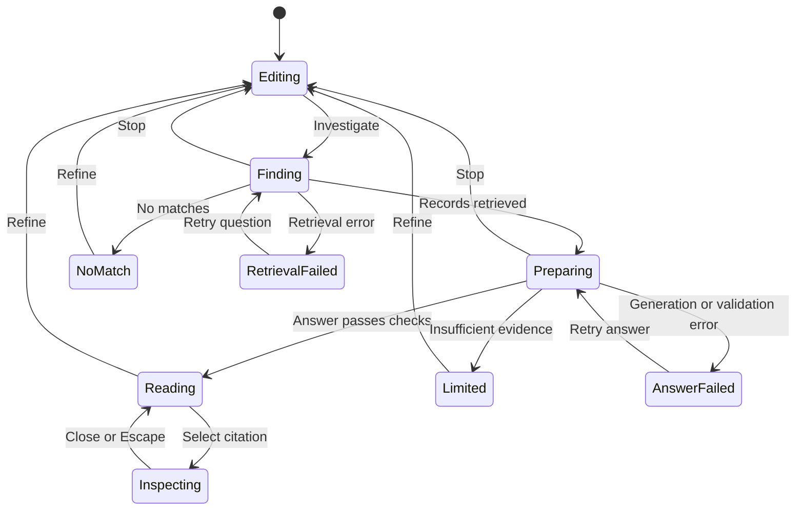

# Evidence-grounded answers — first implementation

An engineer should learn something that changes what they investigate next, with enough evidence to assess that interpretation before committing engineering attention. This slice provides a direct answer, attributed observations, interpretations, uncertainty and one proposed experiment with a measurement and decision rule. It does not establish that the proposed experiment will work.

## Interaction and acceptance contract



| Transition | Acceptance behavior | Backing tests |
|---|---|---|
| Finding → Preparing (T03) | Evidence remains visible; input locked; Stop available | `answer-ui.unit`, `answer.spec` |
| Preparing → Reading (T04) | Direct answer, cited claims, uncertainty and one measurable proposed next step | `answer.worker`, `answer-contract.unit`, `answer.spec` |
| Preparing → Limited (T05) | Explain missing evidence; do not invent a recommendation; retain evidence | Same suites plus `answer-ui.unit` |
| Preparing → AnswerFailed (T06) | Invalid citations, wrong quotes, missing measurement, timeout and provider errors never render as an answer or “no evidence” | `answer.worker`, `answer.spec` |
| Preparing → Editing (T07) | Stop immediately; retain question; ignore late success/failure | `answer-ui.unit`, `answer.spec` |
| AnswerFailed → Preparing (T08) | Explicit retry; no repeat retrieval; duplicate submissions prevented | `answer-ui.unit`, `answer.spec` |
| Reading/Limited → Editing (T10/T13) | Keep question for refinement | `answer-ui.unit`, `answer.spec` |
| Reading ↔ Inspecting (T11/T12) | Citation opens its canonical passage and original attribution; Escape restores focus | `answer.spec` |
| Reading → Copied (T14) | Copy retains question, sources, snapshot IDs, caveats and proposed measurement | `answer-ui.unit`, `answer.spec` |

Existing retrieval and indexed-passage inspection contracts remain available, including when answer generation is disabled. Desktop and mobile run the same acceptance scenarios.

## Architecture and evidence boundaries

1. Existing `GET /api/search?q=…&passages=1` retrieves indexed EAE pages. When the required answer bindings and switch are enabled it additionally returns `answer_available: true`.
2. Browser submits `POST /api/search/answer` with only `{query, record_ids}`: at most five validated IDs. It cannot supply evidence text, provenance or model instructions. Selection IDs are untrusted; they can select any public canonical record, but cannot change its contents. Collection-only results produce a limited answer without inference.
3. Worker loads those IDs from existing D1 `main`, through the shared read model. Preview projection headers are intentionally ignored. This avoids presenting indexed EAE text as a fresh original-source quotation. The selection may still reflect an older search index; this is not exhaustive retrieval or a freshness guarantee about the original report.
4. Whole canonical records, including observations, interpretations, source lineage, limitations and open questions, become the model context. Records over 10,000 UTF-8 bytes, missing records or records without observations/limitations are omitted as a whole and counted. We never trim away caveats to fit the budget. Database failures are technical errors, not evidence insufficiency.
5. One Workers AI call (`@cf/meta/llama-3.3-70b-instruct-fp8-fast`) requests JSON mode. The Worker validates the output independently and returns a complete answer only after validation. No raw token streaming or auto-repair calls.
6. Each source and passage has a stable SHA-256 identity. Each source includes a digest of its canonical snapshot, original attribution, and field labels. `loaded_at` says when D1 was read; it is not a publication date or original-source verification timestamp. D1 is the current projection, which can lag a Git merge.
7. UI presents the answer as **AI interpretation**, differentiates reported observations, and exposes cited excerpts, entire canonical fields and limitations in the existing inspector. Indexed retrieval cards retain their own inspector, clearly separated from canonical answer citations.

No new database, queue, durable object, workflow, vector index or agent loop. The existing Worker gets Workers AI, the existing evidence D1 binding, and a rate-limit binding. The Pages `/api/search/answer` bridge reuses `SEARCH_API`. Preview Pages use the deployed production Worker and main evidence, not candidate Worker code or preview evidence. Candidate integration is tested locally and in CI with actual handlers and deterministic bindings.

The current answer schema lives in `workers/ai-search/answer.js`. An answered result requires cited summary, 1–4 cited claims, 1–4 uncertainties, and one proposed next step (`action`, `measure`, `decision_rule`, citations). A limited result has no claims or next step and explains what is missing. Unknown fields, invalid references, quotes not occurring exactly in the cited passage, observation claims citing interpretation fields, and missing required fields are rejected.

**Mechanical validation establishes traceability, not entailment.** A genuine quote can still be misinterpreted. Neither primary provenance nor multiple EAE records establishes independent corroboration. Those boundaries are in the prompt and interface; their semantic preservation must be evaluated using real model outputs. The model does not browse or verify the original source.

## Bounds and operations

- Question ≤500 UTF-16 code units; body ≤4,096 bytes; ≤5 records of ≤10,000 UTF-8 bytes each.
- One call, ≤1,800 output tokens; 25-second deadline for database loading and inference after rate-limit admission. No automatic retries.
- Six answer attempts per client IP per minute per Cloudflare location. Shared/unknown IPs share a bucket. The platform limiter is approximate and per location; it is not a global spend cap. Namespace `2026100501` is reserved for this feature in this repository; confirm it is unused by other Workers in this account before rollout.
- Stop cancels the browser request and suppresses late results. Neither Stop nor the deadline guarantees cancellation/refund of inference already started. No persistence of questions/answers is added.
- Logs contain model, outcome, record count, omissions, duration and token usage when supplied. They exclude questions, passages, answers and client IPs. Invalid outputs return 502; provider/database/deadline failures 503; rate limit 429 with Retry-After.

Production deployment uses the existing production environment variables `EVIDENCE_DB_NAME` and `EVIDENCE_DB_ID` already used by evidence synchronization. `configure-deploy.mjs` creates an ignored Wrangler configuration with that binding. The checked-in config adds Workers AI and a rate limiter; no new API secret is required by the code. The deploy token/account must permit those bindings. Never create a replacement database to satisfy deployment.

`EAE_ANSWER_ENABLED` is an optional production environment variable (`true` by default). Set it to `false` and redeploy to disable generation and hide the answer capability while preserving search. This is an initial experimental release; review the live evaluation before promoting it as reliable advice. New Worker capabilities become available only after the Worker deploy, independently of Pages.

## Local and CI verification

```sh
npm ci
npx playwright install --with-deps chromium
npm run check
```

Node Vitest tests pure validation and lifecycle code. Cloudflare's `@cloudflare/vitest-plugin` runs Worker tests inside workerd, including the existing SQL migrations and real local D1 reads, with deterministic AI binding responses. Playwright exercises the actual Worker handlers through fixture adapters on desktop and mobile. No Cloudflare account, remote inference or secrets are needed for this suite. `PLAYWRIGHT_CHROMIUM_EXECUTABLE_PATH` can select an existing Chromium locally; CI installs the lockfile-pinned Playwright browser.

For a build-only deployment check, set the two existing D1 environment variables, run `node workers/ai-search/configure-deploy.mjs`, then `npx wrangler deploy --dry-run --config workers/ai-search/wrangler.deploy.json`. Use the generated config for an explicitly requested live development session too; live AI calls consume account quota. Do not point test fixtures at production D1.

## Real-model evaluation before claiming reliability

Deterministic fixtures prove software behavior, not answer usefulness, groundedness or a measured user outcome. The fixture suite deliberately covers malformed outputs and boundary failures. A live runner captures six real question cases, latency, full canonical sources, answers, mechanical validation and an out-of-domain abstention case:

```sh
npm run eval:answer -- --base-url https://agenticengineering.science --output .artifacts/answer-evaluation.json
```

Run only after that endpoint has answer bindings deployed and enabled; this makes up to six paid inference calls. Leave the rate-limit window free or retry later. CI does not call a live model. Human review must fill every case's `human_review` fields:

- Every factual claim and summary conclusion follows from its cited evidence; reject unsupported extrapolation, false causality, false independence or lost attribution.
- Source limitations and relevant contradictory observations are preserved. Unsupported questions abstain with useful missing-evidence guidance.
- The answer addresses the actual engineering question, and its proposed experiment is reversible, specific and has an actionable measure/decision rule.
- Record latency and token usage; evaluate actual burden alongside usefulness. Do not treat a passing schema as a passing answer.

Any unsupported consequential claim or lost epistemic boundary blocks a reliability claim. One reviewed run remains a small sample, not a reliability estimate. Before widening use, repeat the corpus across model/prompt changes and gather whether engineers changed what they investigated or chose a concrete experiment. No real-model evaluation or outcome improvement is asserted by the fixture tests.

Official API references: [Workers AI JSON mode](https://developers.cloudflare.com/workers-ai/features/json-mode/), [model](https://developers.cloudflare.com/workers-ai/models/llama-3.3-70b-instruct-fp8-fast/), [rate-limit binding](https://developers.cloudflare.com/workers/runtime-apis/bindings/rate-limit/).
